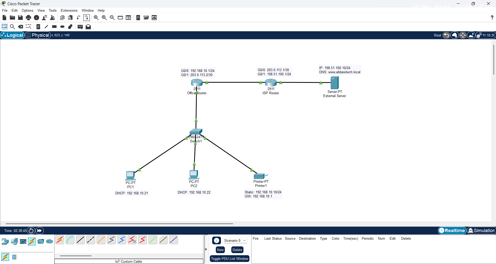
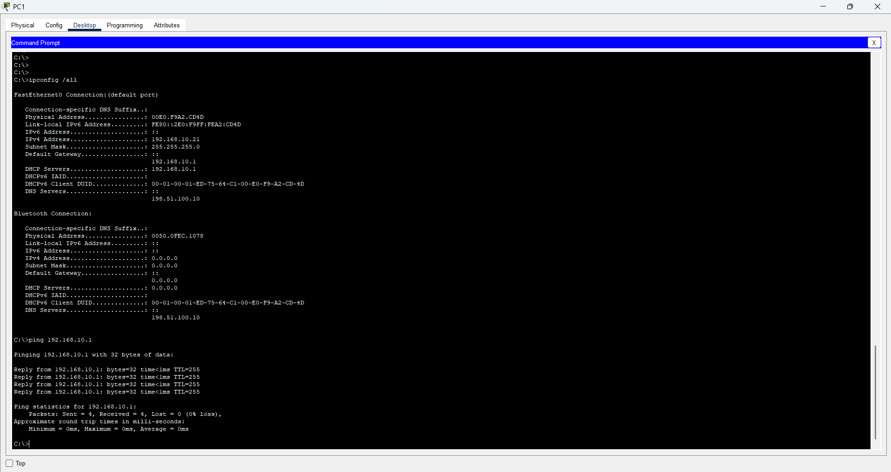
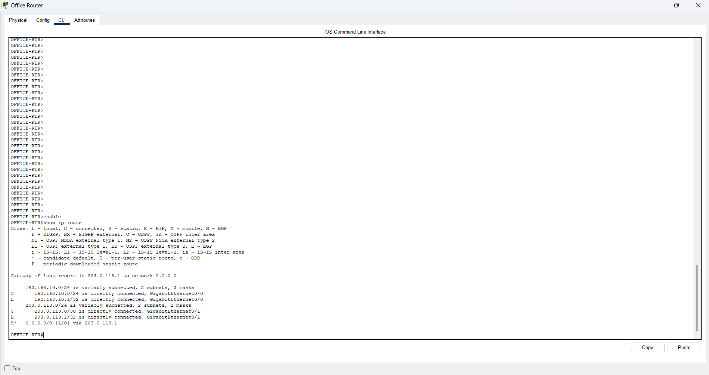
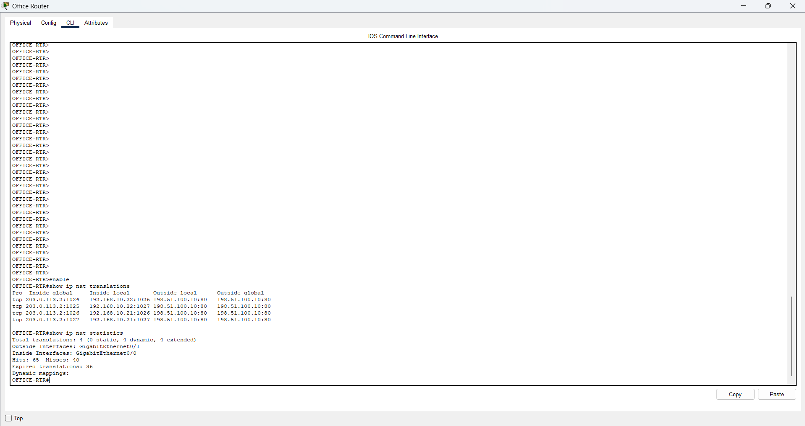
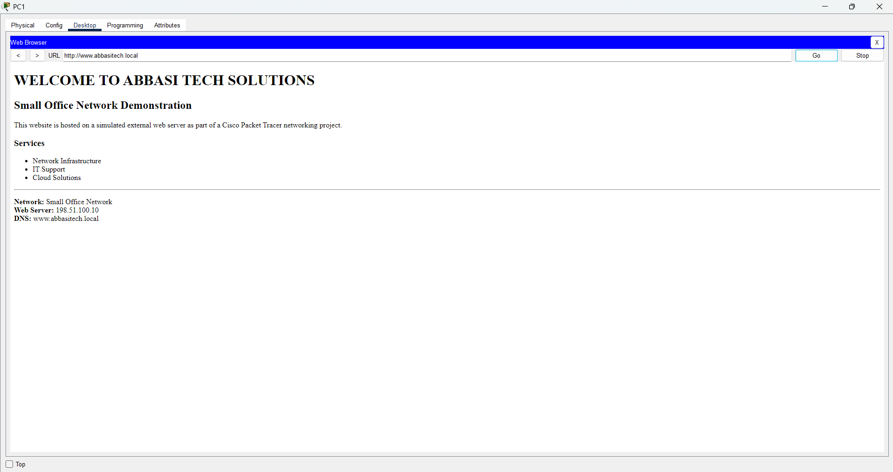
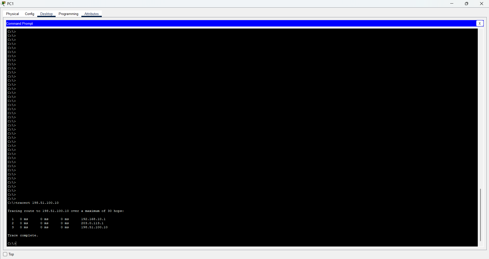
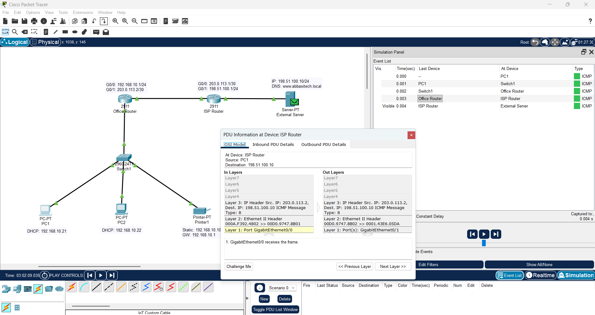

# Small Office Network

A small office network designed and simulated in **Cisco Packet Tracer**, demonstrating fundamental networking concepts including DHCP, IPv4 addressing, routing, NAT/PAT, DNS, HTTP, ARP, ICMP, and network troubleshooting.

## Project Overview

This project simulates a small office network connected to an external network through an ISP router.

The office network provides automatic IP configuration to client PCs through DHCP, uses a static IP for a network printer, and provides access to an external DNS and web server.

The project was designed to demonstrate the practical operation of a small routed network, including:

* IPv4 addressing and subnetting
* DHCP configuration
* Default gateway operation
* Static routing
* NAT/PAT
* DNS name resolution
* HTTP web access
* ARP
* ICMP
* Network troubleshooting and verification
* Packet inspection using Cisco Packet Tracer Simulation Mode

## Network Topology



### Network Components

| Device          | Role                                        |
| --------------- | ------------------------------------------- |
| OFFICE-RTR      | Office gateway, DHCP server, NAT/PAT router |
| Switch          | Office LAN connectivity                     |
| PC1             | DHCP client                                 |
| PC2             | DHCP client                                 |
| Printer         | Static network device                       |
| ISP-RTR         | Simulated ISP router                        |
| External Server | DNS and HTTP server                         |

## IP Addressing

### Office LAN

**Network:** `192.168.10.0/24`

| Device / Interface | IP Address         | Configuration   |
| ------------------ | ------------------ | --------------- |
| OFFICE-RTR G0/0    | `192.168.10.1/24`  | Default gateway |
| Printer            | `192.168.10.10/24` | Static          |
| PC1                | `192.168.10.21/24` | DHCP            |
| PC2                | `192.168.10.22/24` | DHCP            |

### WAN / ISP Network

| Device / Interface | IP Address       | Network          |
| ------------------ | ---------------- | ---------------- |
| OFFICE-RTR G0/1    | `203.0.113.2/30` | `203.0.113.0/30` |
| ISP-RTR G0/0       | `203.0.113.1/30` | `203.0.113.0/30` |

### External Network

| Device / Interface | IP Address         | Configuration    |
| ------------------ | ------------------ | ---------------- |
| ISP-RTR G0/1       | `198.51.100.1/24`  | External gateway |
| External Server    | `198.51.100.10/24` | Static           |

## DHCP

The office router operates as the DHCP server for the `192.168.10.0/24` LAN.

The addresses `192.168.10.1` through `192.168.10.20` are excluded from the DHCP pool.

### DHCP Configuration

```text
ip dhcp excluded-address 192.168.10.1 192.168.10.20

ip dhcp pool OFFICE-LAN
 network 192.168.10.0 255.255.255.0
 default-router 192.168.10.1
 dns-server 198.51.100.10
```

PC1 and PC2 successfully received their IP address, subnet mask, default gateway, DHCP server, and DNS server automatically.



## Routing

The office router has directly connected routes for the office LAN and WAN network.

A static default route forwards unknown destinations toward the ISP router.

```text
ip route 0.0.0.0 0.0.0.0 203.0.113.1
```

The routing table was verified using:

```text
show ip route
```



## NAT/PAT

The office LAN uses private IPv4 addressing.

NAT/PAT translates internal addresses to the OFFICE-RTR WAN interface address when traffic leaves the office network.

### NAT Configuration

```text
access-list 1 permit 192.168.10.0 0.0.0.255

ip nat inside source list 1 interface GigabitEthernet0/1 overload
```

The interfaces were configured as:

```text
interface GigabitEthernet0/0
 ip nat inside

interface GigabitEthernet0/1
 ip nat outside
```

NAT operation was verified using:

```text
show ip nat translations
show ip nat statistics
```

The translation table demonstrated private client addresses such as `192.168.10.21` being translated to the router's WAN address `203.0.113.2`.



## DNS

The external server was configured as the DNS server.

An A record was created:

```text
www.abbasitech.local → 198.51.100.10
```

DNS resolution was verified from the client using:

```text
nslookup www.abbasitech.local
```

## HTTP

The same external server also hosts the project's simulated website.

The HTTP service was enabled and customized to display an **Abbasi Tech Solutions** demonstration page.

The website was accessed from PC1 using:

```text
http://www.abbasitech.local
```

This demonstrates the complete application-layer path:

```text
PC → DNS resolution → IP address → Routing → NAT/PAT → HTTP server
```



## Network Testing & Verification

Several tools and Packet Tracer features were used to verify the network.

### Connectivity Testing

ICMP ping was used to verify connectivity between:

* PC1 and the default gateway
* PC1 and the printer
* PC1 and PC2
* Office clients and the external server

Example:

```text
ping 192.168.10.1
ping 198.51.100.10
```

### DNS Testing

```text
nslookup www.abbasitech.local
```

The hostname successfully resolved to:

```text
198.51.100.10
```

### Path Testing

The route from PC1 to the external server was verified using:

```text
tracert 198.51.100.10
```

The observed path was:

```text
PC1
 ↓
192.168.10.1
 ↓
203.0.113.1
 ↓
198.51.100.10
```



### ARP Verification

The client ARP table was inspected using:

```text
arp -a
```

This demonstrated local Layer 2 address resolution for devices on the office LAN.

### Router Verification

The following commands were used to inspect the router configuration and operation:

```text
show ip route
show ip nat translations
show ip nat statistics
show access-lists
show running-config
```

## Packet Tracer Simulation

Cisco Packet Tracer Simulation Mode was used to observe packet movement through the network.

An ICMP packet was followed from PC1 toward the external server to observe how the packet passes through the office router and ISP router.

The simulation demonstrated the relationship between:

* Ethernet frames
* MAC addresses
* IP addresses
* Routing
* NAT
* ICMP



## Network Services

| Service | Implementation       |
| ------- | -------------------- |
| DHCP    | OFFICE-RTR           |
| DNS     | External Server      |
| HTTP    | External Server      |
| NAT/PAT | OFFICE-RTR           |
| Routing | OFFICE-RTR + ISP-RTR |
| ARP     | End devices / LAN    |
| ICMP    | Connectivity testing |

## Repository Structure

```text
small-office-network/
│
├── README.md
│
├── Small-Office-Network.pkt
│
└── images/
    ├── 01-network-topology.png
    ├── 02-dhcp-client-connectivity.png
    ├── 03-office-router-routing-table.png
    ├── 04-nat-pat.png
    ├── 05-dns-http-website.png
    ├── 06-traceroute.png
    └── 07-pdu-simulation.png
```

## Tools & Technologies

* Cisco Packet Tracer
* IPv4
* DHCP
* DNS
* HTTP
* NAT/PAT
* Static Routing
* ARP
* ICMP
* TCP/IP
* Network troubleshooting

## Key Learning Outcomes

Through this project, I practiced designing and implementing a small routed network rather than only studying networking concepts theoretically.

Key areas practiced include:

* Designing an IPv4 addressing scheme
* Configuring router interfaces
* Configuring DHCP
* Configuring static routing
* Implementing NAT/PAT
* Understanding default gateways
* Understanding ARP and MAC address resolution
* Configuring DNS and HTTP services
* Testing end-to-end connectivity
* Troubleshooting network connectivity
* Inspecting packet movement using Simulation Mode
* Verifying network operation through Cisco IOS commands

## Project Status

**Completed**

This project represents my initial practical networking portfolio project while preparing for the **Cisco CCNA** certification.

